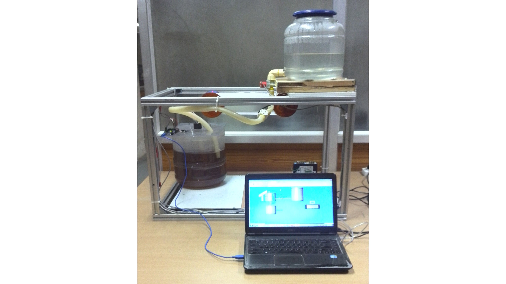

#### Title: 
~ Automation of instant-tea powder making process using PLC and SCADA

#### Objective:
~To automatically monitor and control temperature and level

* This project is based on industrial process automation.

* The process under consideration is instant-tea powder making process, in which there is a need for monitoring and automatic control of  
  various parameters e.g. temperature, level and flow etc. at different stages of the process.

* Motivation is to implement the theoretical concepts to practical i.e. to exhibit process automation using two very important components     of industrial automation Programmable Logic Controller (PLC), which is also called industrial digital computer and Supervisory Control  
  And Data Acquisition (SCADA).

* Increased productivity, reduced human error, high quality and reliability are among many advantages of process automation, as a whole 
  automation plays a crucial role in almost every industry

* I considered an instant-tea powder manufacturing process, where I developed a prototype of a part of the full process.

* Objective is to show monitoring and automatic control of two important process parameters i.e. Temperature and Level.

* PLC has been used as interface between field I/O devices and SCADA system.

* SCADA system is used to monitor the I/O status.

* The Components used for the project and SCADA screen result during process has been shown by videos which are self-explanatory.

* Another video shows the experiment running condition

<video src="4_My_SCADA_RESULT_ Movie.mp4" width="320" height="200" controls preload></video>

#### Demo:
https://github.com/user-attachments/assets/2562d298-8bf3-42e9-bf26-fa4068b62596
https://github.com/user-attachments/assets/5172aa25-b219-42cb-99a2-2489f96b260b
https://github.com/user-attachments/assets/51ace200-dcc3-46f6-8422-5d2268ced298

